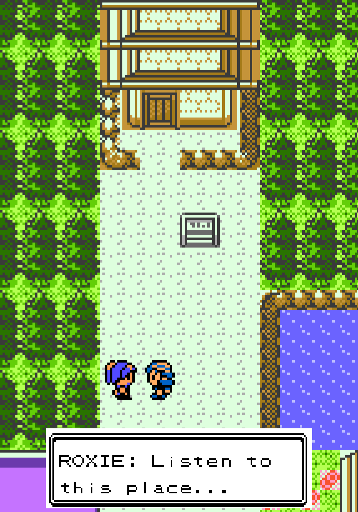
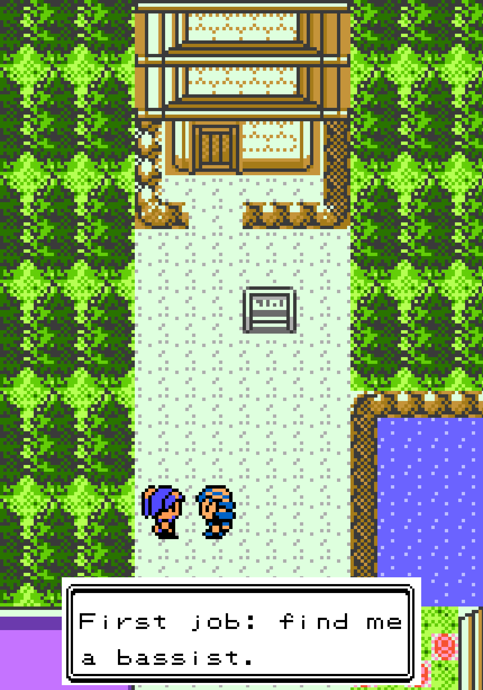
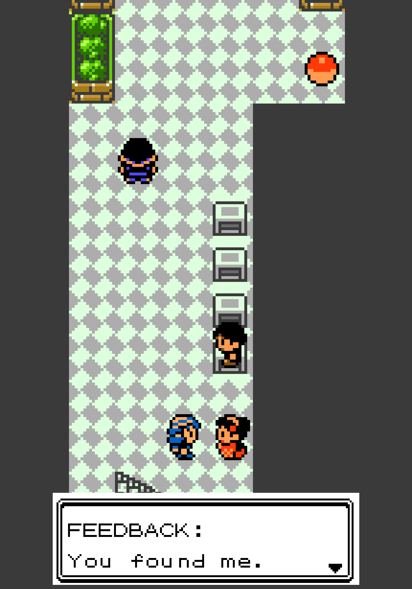
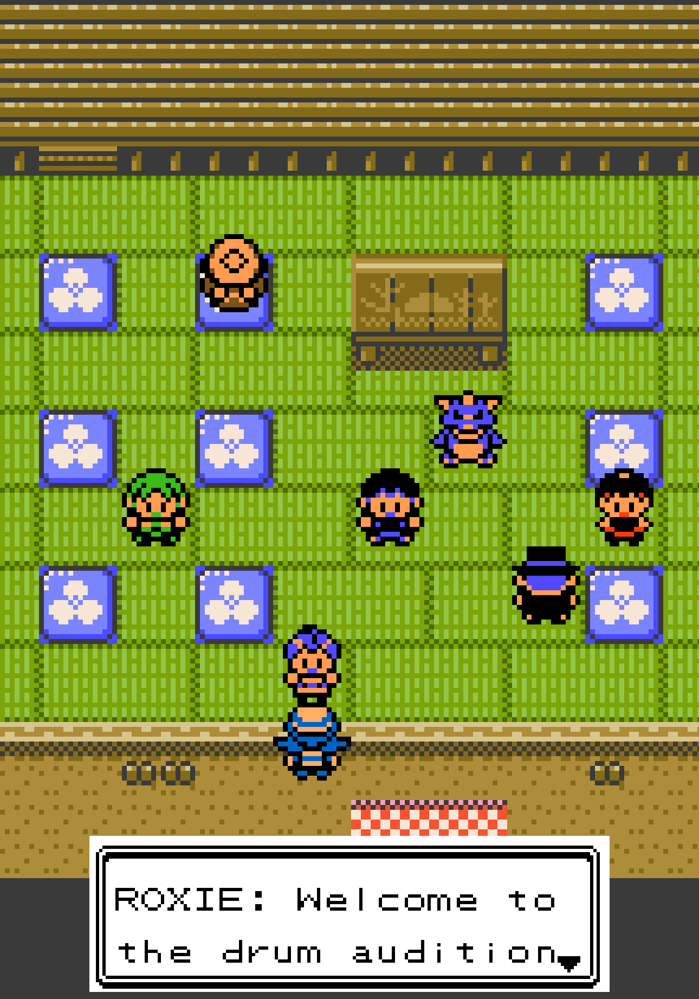
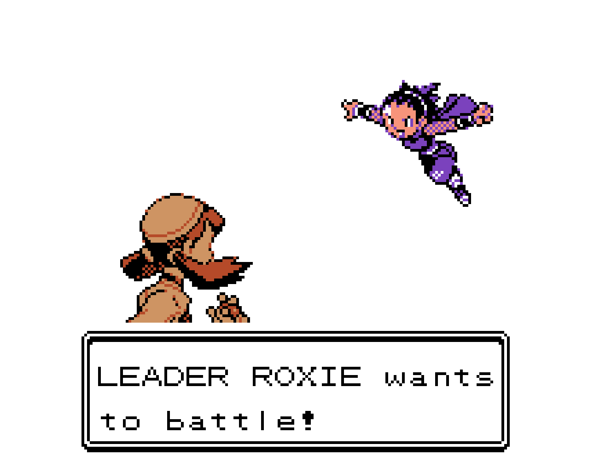

# Kanto Rocks

ROXIE came to JOHTO looking for a music scene and found temple bells, monks
and somebody's sleeping WOOPER. So she is starting a band out of spite, and
you are her manager. Recruit the members, promote the gig, then find out
what happens when PIERS turns up to crash the encore.

A quest mod for [gen1recomp](https://github.com/bryanthaboi/gen1recomp),
mod API 2, **Pokemon Gold**.

**Status: v0.4.2 — ALPHA.** ROXIE turns up near the VIOLET GYM once you
have a badge, challenges you, and appoints you as her manager if you win. Your
first job is finding the mysterious bassist FEEDBACK in GOLDENROD's
UNDERGROUND. Bring three badges, win the audition, and discover who has been
playing in secret. Then visit ECRUTEAK's DANCE THEATER, investigate an
audition interrupted by JIGGLYPUFF, and identify the drummer who kept time.
Promotion, the gig and PIERS come afterward.

## Screenshots

<table>
<tr>
<td width="50%"></td>
<td width="50%"></td>
</tr>
<tr>
<td>ROXIE is unimpressed by how quiet VIOLET CITY is.</td>
<td>Win, and you are her manager whether you agreed or not.</td>
</tr>
<tr>
<td></td>
<td></td>
</tr>
<tr>
<td>The bassist plays GOLDENROD's UNDERGROUND under a false name.</td>
<td>Three drummers, three ideas of a beat, one JIGGLYPUFF.</td>
</tr>
</table>

She does not audition you politely.

## Requirements

- gen1recomp **0.1.78 or newer** — the release Gen 2 support shipped in
- A Pokemon **Gold** boot. This mod is Gen 2 only and is skipped on a
  Red/Blue/Yellow boot. That is expected, not a fault.

## Install

Download `kanto_rocks-<version>.zip` from
[the latest release](../../releases/latest), then in the launcher choose
**MODS → Import mod .zip** and fully quit and relaunch.

On iOS, delete any older downloaded copy from Files first. To update
later, the mod's entry shows "vX.Y.Z available" — tap it, choose
**Update**, then fully quit and relaunch.

## Development preview

This is an alpha and the questline is unfinished — it ends after the
drummer joins. Bug reports are welcome on
[GitHub Issues](../../issues); please include the version from the load
banner and which other mods you had enabled.

**Quest System is optional.** Install it and the questline also keeps an
entry in the journal; without it everything else behaves identically. It
is deliberately not a hard requirement: Quest System ships as a loose zip
committed to another repository with no GitHub releases behind it, so the
launcher cannot install or update it for you, and making you hunt that
file down by hand is not a fair price for a journal line.

## Design decisions worth knowing

### Why Gold-only, and why that was a rewrite

Gen 2 in this engine is a **parallel implementation**, not an extension. A
Gold boot never loads the Gen 1 game, overworld or battle modules at all,
so a Gen 1 pattern aimed at them does not degrade gracefully — it lands on
something nothing instantiates and does nothing, quietly. Moving towns was
the small part of this port. Four mechanisms had to be replaced:

| What | Gen 1 | Gold |
|---|---|---|
| Dialogue | `map_scripts` talk block | `world.interacted` + `queueScript` |
| Badges | `Badges.count(data, save)` | `save.player.badges` + `.kantoBadges` |
| NPC movement | `"STAY"` string | numeric (`STANDING_DOWN = 6`) |
| On-screen output | `TextBox` | `Runtime.reportError` → `[ERRS]` |

The dialogue one is the interesting one, because **Gold has no supported
way for a mod to author NPC speech**. Talking dispatches on an NPC's
`scriptKey` into the cart's decoded bytecode pool, and the `map_scripts`
registry has no Gen 2 home — a Lua row list merged into `gen2Scripts` is
not something Gold's script VM can run, so the registry is gated on a Gold
boot rather than silently merged.

The route through: `World:interactBody` tries trainer, boulder, itemball,
scriptKey, sign, hidden item, std-tile and field-move in turn, and when
nothing matches it emits `world.interacted` with `kind = "none"` and the
faced cell's coordinates. A mod-spawned NPC has no `scriptKey`, so an A
press aimed at ROXIE falls all the way through to there. The mod
recognises her cell and queues the text itself.

Court of Noctowl subsequently proved this route on a real Gold boot. Kanto
Rocks now uses the same path for every stage of ROXIE's conversation.

### Roxie is her own NPC, not a takeover

She has her own object rather than borrowing a townsperson's dialogue.
On Gold that is not really a choice — there is no vanilla line to take
over in a way the engine would run — but it was the right call on Gen 1
too: it means no per-version text-constant hunt, and no other mod editing
Violet City can silently clobber her, or be clobbered by her.

Her current device-adjusted position is fixed at `(22,12)`, four cells right
and seven cells up from the first Gym-area test position. She initially faces
right.

### The audition battle

ROXIE's battle uses the native Gold trainer flow proven by Indigo Plateau
Conference. JANINE supplies the Poison-leader portrait and battle class;
the trainer is temporarily named ROXIE, and `trainer.party` supplies a
level 10 EKANS and level 12 KOFFING. JANINE's row is restored immediately
afterward. The battle is safely losable: defeat does not black the player
out, and ROXIE remains available for a retry.

### The bassist

Once the player becomes ROXIE's manager, FEEDBACK appears in the GOLDENROD
UNDERGROUND beside the south entrance, using a KIMONO GIRL disguise. The
designed cell is `(6,33)`; on device she actually stands at `(5,33)`, the
first fallback, because the designed one is not free. The fallback search is
load-bearing here, not decorative -- do not narrow it without re-testing.
FEEDBACK will speak to any
player but only auditions someone carrying three badges. The native battle
intro supplies the surprise: the opponent is LEADER WHITNEY, with CLEFAIRY,
SNUBBULL and MILTANK. After victory she admits FEEDBACK is her private stage
name, explains that the borrowed kimono and cheap wig hide her from Gym
regulars, agrees to one show and one encore, and changes to her real overworld
sprite. Loss is safe and repeatable.

### The drummer

After ROXIE learns FEEDBACK's identity, she sends the player to an open
audition in ECRUTEAK's DANCE THEATER. Three candidates demonstrate distinct
rhythms: GENE counts in three, BILLY insists on five-four, and Johto anime
character CASEY uses her four-beat ELECTABUZZ baseball chant.

JIGGLYPUFF interrupts with its recurring anime singing gag and sends the room
to sleep. On waking, the player learns that one four-beat rhythm continued.
Gold has no supported mod-facing choice box, so the investigation uses the
world itself as the choice: question all three candidates, then speak to the
person you want to select. Wrong answers are safe and repeatable. Selecting
CASEY recruits her as the band's drummer and clears the other audition actors
from the room.

### The HEADLINER ribbon is a field, not a call

kanto_ribbons has no award API. Its exports are `{ version, hasRibbon,
catalog }`, and every ribbon it grants comes from a resolver inside that
mod reading save state — the same way it reads snag_quest's `mon.snagged`.

So Kanto Rocks writes and owns `mon.krHeadliner`, and kanto_ribbons picks
it up in its own time. `mon.krPiersGift` is reserved the same way, tagging
the gift Pokemon's provenance.

## Options

| Option | Default | What it does |
|---|---|---|
| Report quest actors | on | Writes actor placement or gating status into the mod manager's `[ERRS]` screen. A development aid; it goes once the questline is stable. |

## Compatibility

Entirely additive: every quest actor is a runtime object owned by this mod.
No vanilla record is overridden and no vanilla dialogue is displaced. Runtime
actors are never serialized, so they do not enter the map-data merge; the mod
rebuilds the appropriate cast from its own saved quest beat on map entry.

Ownership is published at runtime in `mod.exports.owns`, including the two
mon fields reserved for rewards — `mon.krHeadliner` and `mon.krPiersGift`.
Read them freely; do not write them.

## Open questions (TODO/CONFIRM ledger)

Closed by reading engine source at v0.1.78:

- ~~Does the Gen 1 NPC pattern work on Gold~~ — no. `map_scripts` is
  gated on a Gold boot; see above.
- ~~Where Gold keeps badges~~ — `save.player.badges` (Johto) plus
  `save.player.kantoBadges` (Kanto), counted as set flags. Not reachable
  through `getFlag`; that is a different bitfield.
- ~~Can a mod stage a Gold trainer battle~~ — yes. An owned NPC can be armed
  with a numeric trainer class/member, and `trainer.party` can substitute a
  finished custom team. Indigo Plateau Conference proved this on device.
- ~~Quest System export signatures~~ — device-confirmed:
  `register()`, `start()`, `advance()`, `complete()` and `track()` are all
  real functions on its exports table.

Still open:

- ~~Where exactly ROXIE lands~~ — device-adjusted to `(22,12)`, facing right.
- **Where the audition cast should stand.** v0.4.0 starts them close to the
  DANCE THEATER entrance and reports their runtime placement for device
  adjustment.
- **Her sprite.** She wears `SPRITE_COOLTRAINER_F` as a stand-in. Gold's
  overworld sprite space is its own 162 ids, and Gen 1's `paletteSource`
  ROM crosswalk does not carry over, so bespoke art needs Gold's palette
  handling read properly first.
- **kanto_contests scarf reward.** Still a planned slice in that mod
  (`mon.kcScarf`); no scarf item exists in kanto_contests 0.9.0, so there
  is nothing to award yet.

## Credits

By **Mister Miracle**
([@mistermiracle3036](https://github.com/mistermiracle3036)).

- Built on the [gen1recomp](https://github.com/bryanthaboi/gen1recomp)
  engine and pret/pokecrystal + pokered research.
- **Quest System** by FAFF0x — optional journal integration.
- **Kanto Ribbons** — planned optional integration via a mon field.
- ROXIE, WHITNEY, CASEY, JIGGLYPUFF and PIERS appear as fan tribute; no art,
  text or audio from their source games or anime is included.
- Pokemon and all related names are trademarks of Nintendo / Creatures
  Inc. / GAME FREAK inc. This mod contains no ROM data and requires your
  own game copy via gen1recomp.

Longer-form attribution lives in
[THIRD_PARTY_NOTICES.md](THIRD_PARTY_NOTICES.md).
